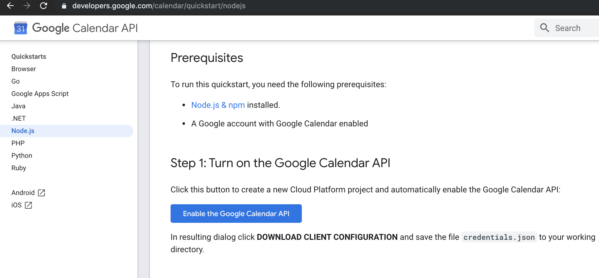

## Google Calendar API Booking System

### Directions:
Step 1: go to https://developers.google.com/calendar/quickstart/nodejs, select 'Enable the Google Calendar API' and click 'Download Client Configuration'. This will download credentials.json - save this into the project directory

    
    

### `Step 2: npm i and node .`

### `Step 3: Click on the link in the console to authorize the app to use the Google Calendar API for your credentials.`

### `Description:`

This app is an appointment booking system that uses the Google Calendar API. 
Users access the API to view available timeslots and book appointments. 
All appointments are 40 minutes long and have fixed times, starting from 9–9:40am, with a 5 minute break between appointments. 
Appointments can only be booked during weekdays between 9am and 6pm 
Appointments can only be made at least 24 hours in advance. 
Appointments cannot be double-booked. 
All appointments use UTC time. 

#### `Once the server is running:`

#### `GET http://localhost:3000/timeslots?year=yyyy&month=mm&day=dd`

Displays all available timeslots for the day
 

#### `GET http://localhost:3000/days?year=yyyy&month=mm`

Displays weather or not all days of the month currently have available timeslots
 

#### `POST http://localhost:3000/book?year=yyyy&month=mm&day=dd&hour=hh&minute=mm`

Books an appointment by creating an event in the calendar, provided that the timeslot is available.
